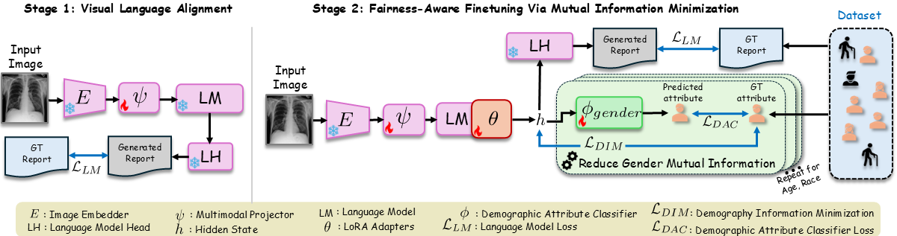
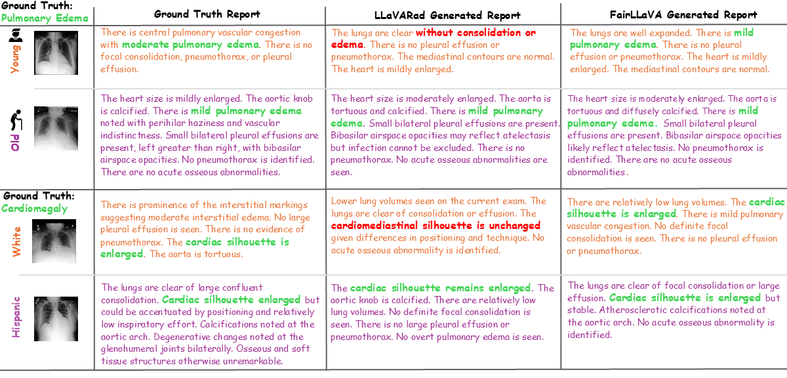

# 🩺 [CVPR2026] FairLLaVA : Fairness-Aware Parameter-Efficient Fine-Tuning for Large Vision-Language Assistants

[Mahesh Bhosale](https://bhosalems.github.io/)<sup>1</sup>, [Abdul Wasi](https://scholar.google.com/citations?user=_2friTYAAAAJ&hl=en)<sup>1</sup>, [Shantam Srivastava](https://scholar.google.com/citations?user=UXG7qiYAAAAJ&hl=en)<sup>1</sup>, Shifa Latif<sup>2</sup>, [Tianyu Luan](https://tyluann.github.io/)<sup>3</sup>, [Mingchen Gao](https://cse.buffalo.edu/~mgao8/)<sup>1</sup>, [David Doermann](https://scholar.google.com/citations?user=RoGOW9AAAAAJ&hl=en)<sup>1</sup>, [Xuan Gong](https://scholar.google.com/citations?user=sTqQ-jgAAAAJ&hl=en)<sup>4</sup>

**<sup>1</sup>University at Buffalo  |  <sup>2</sup>University of Kashmir | <sup>3</sup>Accenture | <sup>4</sup>Harvard Medical School**

[](https://cvpr.thecvf.com/Conferences/2026)
[](https://arxiv.org/abs/2603.26008)
[](https://www.youtube.com/watch?v=wWyS2shQJLc)
[](Figures/Poster_CVPR.pdf)
[](https://huggingface.co/mbhosale/FairLLaVA)


## 📖 Overview

FairLLaVA is a **fairness-aware, parameter-efficient fine-tuning** recipe for medical vision-language assistants. Multimodal LLMs such as LLaVA-Rad show strong image-conditioned generation, yet their outputs can vary in quality across demographic groups (age, sex, race), which is unacceptable in clinical settings. FairLLaVA mitigates this by **minimizing the mutual information** between the model's visual representation and the protected attribute, producing **demographic-invariant** features while preserving clinical accuracy. The method is architecture-agnostic, plugs into a standard LoRA fine-tuning loop, and is validated on chest-radiograph report generation (MIMIC-CXR) and skin-lesion VQA (HAM10000).

### 📄 Abstract

Multimodal large language models excel at image-conditioned generation but can display uneven performance across demographic groups, which is especially concerning in clinical applications. We present FairLLaVA, a fairness-aware fine-tuning technique that minimizes the mutual information between the model's intermediate features and protected attributes to obtain demographic-invariant representations. FairLLaVA is integrated as a lightweight plug-in on top of low-rank adapter (LoRA) fine-tuning and is therefore agnostic to the backbone vision encoder and language model. On MIMIC-CXR radiology report generation and HAM10000 dermoscopy VQA, FairLLaVA reduces inter-group gaps in clinical-quality metrics (RadGraph-F1, GREEN, BLEU, etc.) while matching or improving overall accuracy compared to standard LoRA fine-tuning and prior fairness baselines.

<p align="center">
  
</p>

*Figure 1. FairLLaVA overview. A mutual-information regularizer is attached to the LoRA fine-tuning loop and decorrelates the features from the demographic attribute, while the report-generation cross-entropy loss continues to drive clinical accuracy.*

## 📑 Contents
- [Overview](#-overview)
- [Quick Start](#-quick-start)
  - [Environment setup](#environment-setup)
  - [Inference (single image)](#inference-single-image)
- [Datasets & Preparation](#-datasets--preparation)
- [Training (End-to-End)](#-training-end-to-end)
  - [Stage 1, Projector pretraining](#stage-1-projector-pretraining-alignment)
  - [Stage 2, Fairness-aware LoRA fine-tuning](#stage-2-fairness-aware-lora-fine-tuning)
- [Batched Inference & Evaluation](#-batched-inference--evaluation)
- [Fairness Evaluation (Stratified)](#-fairness-evaluation-stratified)
- [Qualitative Results](#-qualitative-results)
- [Ethics Statement](#️-ethics-statement)
- [Acknowledgements](#-acknowledgements)
- [Citation](#-citation)


## 🚀 Quick Start

### Environment setup

```bash
git clone https://github.com/bhosalems/FairLLaVA.git
cd FairLLaVA

conda create -n fairllava python=3.11 -y
conda activate fairllava
pip install --upgrade pip

# Install FairLLaVA and its training extras (flash-attn, ninja)
pip install -e ".[train]"
```


### Inference

We provide a ready-to-run [inference.py](inference.py) that loads a FairLLaVA LoRA checkpoint on top of Vicuna-7B and BiomedCLIP-CXR, and runs report generation on a single chest X-ray:

```bash
# Set MODEL_PATH to the LoRA checkpoint you trained or downloaded.
CUDA_VISIBLE_DEVICES=0 python inference.py
```

Inside [inference.py](inference.py#L24) point `model_path` to your checkpoint, e.g.:

```python
model_path = ".../checkpoints/biomedclip_cxr_518-lora-1e-1e-4-<timestamp>/checkpoint-<step>"
model_base = "lmsys/vicuna-7b-v1.5"
model_name = "llavarad"
```

### 🤗 Pretrained checkpoints

| Dataset | Base LLM | Vision Tower | MM Projector | FairLLaVA LoRA |
|---|---|---|---|---|
| MIMIC-CXR  | `lmsys/vicuna-7b-v1.5` | BiomedCLIP-CXR 518 | [🤗 link](https://huggingface.co/mbhosale/FairLLaVA/blob/main/mimic-cxr/mm_projector.bin) | [🤗 link](https://huggingface.co/mbhosale/FairLLaVA/tree/main/mimic-cxr) |
| PadChest   | `lmsys/vicuna-7b-v1.5` | BiomedCLIP-CXR 518 | [🤗 link](#) *(to upload)* | [🤗 link](#) *(to upload)* |
| HAM10000   | `liuhaotian/llava-v1.5-7b` | CLIP ViT-L/14-336 | [🤗 link](#) *(to upload)* | [🤗 link](#) *(to upload)* |


## 📦 Datasets & Preparation

| Dataset | Domain | Used for | Source |
|---|---|---|---|
| MIMIC-CXR-JPG | Chest X-ray | Pretrain + LoRA fine-tune | [PhysioNet](https://physionet.org/content/mimic-cxr-jpg/2.0.0/) |
| LLaVA-Rad MIMIC-CXR annotations | Report text + demographics | LoRA fine-tune | [PhysioNet](https://physionet.org/content/llava-rad-mimic-cxr-annotation/1.0.0/) |
| PadChest | Chest X-ray (Spanish) | Pretrain + LoRA fine-tune | [BIMCV](https://bimcv.cipf.es/bimcv-projects/padchest/) |
| HAM10000 (ISIC 2018 Task 3) | Dermoscopy | Pretrain + LoRA fine-tune | [ISIC 2018 Challenge Task 3](https://challenge.isic-archive.com/data/#2018) (primary) · [Harvard Dataverse](https://doi.org/10.7910/DVN/DBW86T) (original release) |

After signing the data-use agreements and downloading the raw images, prepare the dataset-specific JSON files as follows.

**MIMIC-CXR**. Use the train/dev/test JSON files distributed with the LLaVA-Rad MIMIC-CXR annotation on PhysioNet (already in LLaVA conversation format, with demographics columns). The MIMIC-CXR loaders in this repo (`mimic_train_findings`, `mimic_test_findings`) read these files directly. See the [LLaVA-Rad](https://github.com/microsoft/LLaVA-Rad) repo for the original preprocessing recipe.

**PadChest**. Convert BIMCV's PadChest reports into `train_findings.json` and `test_findings.json` following the [LLaVA-Rad](https://github.com/microsoft/LLaVA-Rad) MIMIC processig. The output schema (image relative path, findings text, age, gender, ...) is the one our `padchest_train_findings` / `padchest_test_findings` loaders expect. Please check the supplementary for more details.

**HAM10000**. Two steps.

1. Obtain a per-image QA JSON for HAM10000 (`round-1-QA_gen_HAM10000.json`), with entries of the form `{img_path, image_id, new_QA: [{Q, A}, ...]}`. We use the QA pairs generated by the concept-grounded synthesis pipeline of **SelfSynthX** ([Shi et al., ICLR 2025](https://openreview.net/forum?id=lHbLpwbEyt) · [arXiv:2502.14044](https://arxiv.org/abs/2502.14044) · [code](https://github.com/sycny/SelfSynthX)). Follow the `src/step1.{1,2,3}_*.py` pipeline in the SelfSynthX repo to produce the round-1 QA JSON. The HAM10000 images and the ground-truth lesion labels themselves come from the [ISIC 2018 Challenge Task 3](https://challenge.isic-archive.com/data/#2018).
2. Convert that QA JSON together with the canonical `HAM10000_metadata` CSV into LLaVA-format splits using:

```bash
python scripts/prepare_ham10000_qa_llava_json.py \
  --qa-json       /path/to/HAM10000/round-1-QA_gen_HAM10000.json \
  --metadata-csv  /path/to/HAM10000/HAM10000_metadata \
  --out-json      /path/to/HAM10000/HAM10000_round3_qa_llava_all.json \
  --flatten-all-qa \
  --write-split-files \
  --test-size 1000 --val-size 100 --seed 0
```

This writes `HAM10000_round3_qa_llava_{train,val,test}.json` next to `--out-json`, which the `ham10000_train_qa` / `ham10000_test_qa` loaders pick up.

## 🏋️ Training (End-to-End)

> Before running, edit the paths at the top of each script (`data_path`, `image_folder`, `vision_tower_checkpoint`, `PROJECTOR`) to match your local setup. 

### Stage 1, Projector pretraining (alignment)

Only the MM projector is trained. The vision encoder and LLM are frozen.

```bash
# MIMIC-CXR (BiomedCLIP-CXR ViT)
bash scripts/pretrain_mimic.sh

# PadChest (BiomedCLIP-CXR ViT)
bash scripts/pretrain_padchest.sh

# HAM10000 (CLIP ViT-L/14-336)
bash scripts/pretrain_ham10000_mm_projector.sh
```

Outputs `mm_projector.bin` under `./checkpoints/<run_name>/`.

### Stage 2, Fairness-aware LoRA fine-tuning

Joint LoRA fine-tuning with the FairLLaVA mutual-information regularizer. The fairness behaviour is controlled by a JSON config in [configs/](configs/), which sets the protected attribute, the MI lambda, and the MI optimizer.

```bash
# MIMIC-CXR FairLLaVA (MI regularizer on demographics)
bash scripts/finetune_lora_mi.sh

# PadChest FairLLaVA
bash scripts/finetune_lora_padchest_mi.sh

# HAM10000 FairLLaVA
bash scripts/finetune_lora_ham10000_mi.sh
```

Useful environment overrides:

```bash
FAIRNESS_CONFIG=configs/fairness_finetune_mimic_cxr_mi.json \
RUN_TAG=mi_lambda_0.6 SEED=42 \
bash scripts/finetune_lora_mi.sh
```

## 🔮 Batched Inference & Evaluation

[scripts/infer_eval.py](scripts/infer_eval.py) shards inference across all visible GPUs, merges the predictions, and (optionally) runs the evaluators.

**MIMIC-CXR FairLLaVA checkpoint:**

```bash
CUDA_VISIBLE_DEVICES=0 python scripts/infer_eval.py \
  --model_base lmsys/vicuna-7b-v1.5 \
  --model_path /path/to/checkpoints/biomedclip_cxr_518-lora-3e-1e-4-ce_loss_weight_5.0-<timestamp> \
  --prefix    "mimic_cxr_fairllava" \
  --query_file   /path/to/chat_test_MIMIC_CXR_all_dem.json \
  --image_folder /path/to/mimic-cxr-jpeg/files/ \
  --loader   mimic_test_findings \
  --dataset  mimic-cxr \
  --prediction_dir /path/to/results/mimic_cxr_fairllava \
  --fairness_finetune False \
  --batch_size 8
```

A bash equivalent for multi-GPU sharding of just the inference stage is available at [scripts/infer_eval.sh](scripts/infer_eval.sh).

## 📊 Fairness Evaluation (Stratified)

After inference produces `merged_preds.jsonl`, evaluate **overall** and **per-demographic-subgroup** clinical quality (BLEU / ROUGE / RadGraph-F1 / [GREEN](https://github.com/Stanford-AIMI/GREEN) / CheXbert / etc.) with:

```bash
bash scripts/evaluate_fairness.sh \
  /path/to/results/<run_name> \
  <log_prefix> \
  MIMIC-CXR      # or PadChest, or HAM10000
```

This will:
1. Run the overall RRG evaluator on `merged_preds.jsonl`.
2. Stratify predictions into per-group files (`age_*.jsonl`, `gender_*.jsonl`, `race_*.jsonl`, where race is only available for MIMIC-CXR).
3. Re-run the evaluator per group.

## 🖼 Results

<p align="center">
  
</p>

*Figure 2. Qualitative comparison on MIMIC-CXR. FairLLaVA produces reports that are consistent in clinical content across demographic subgroups, while the LLaVARad generates inconsistent results.*

Please find more results in the paper.
## ⚠️ Ethics Statement

This codebase and the released checkpoints are intended **strictly for research and educational use**. They are **not** approved or validated for clinical or diagnostic deployment, and **must not** be used to make medical decisions or to inform patient care. All datasets used are subject to their original data-use agreements.

## 🤝 Acknowledgements

This work builds heavily on [LLaVA](https://github.com/haotian-liu/LLaVA) v1.5 and [LLaVA-Rad](https://github.com/microsoft/LLaVA-Rad). We use the [GREEN](https://github.com/Stanford-AIMI/GREEN) metric for radiology-report evaluation. We thank the authors and curators of the [MIMIC-CXR](https://physionet.org/content/mimic-cxr-jpg/2.0.0/), [PadChest](https://bimcv.cipf.es/bimcv-projects/padchest/), and [HAM10000](https://challenge.isic-archive.com/data/) datasets for making them publicly available, and PhysioNet / BIMCV / ISIC for hosting them. Please follow each dataset's data-use agreement when using this codebase, and cite the corresponding papers below.

## 📑 Citation

If you find FairLLaVA useful, please cite:

```bibtex
@article{bhosale2026fairllava,
  title={FairLLaVA: Fairness-Aware Parameter-Efficient Fine-Tuning for Large Vision-Language Assistants},
  author={Bhosale, Mahesh and Wasi, Abdul and Srivastava, Shantam and Latif, Shifa and Luan, Tianyu and Gao, Mingchen and Doermann, David and Gong, Xuan},
  journal={arXiv preprint arXiv:2603.26008},
  year={2026}
}
```
